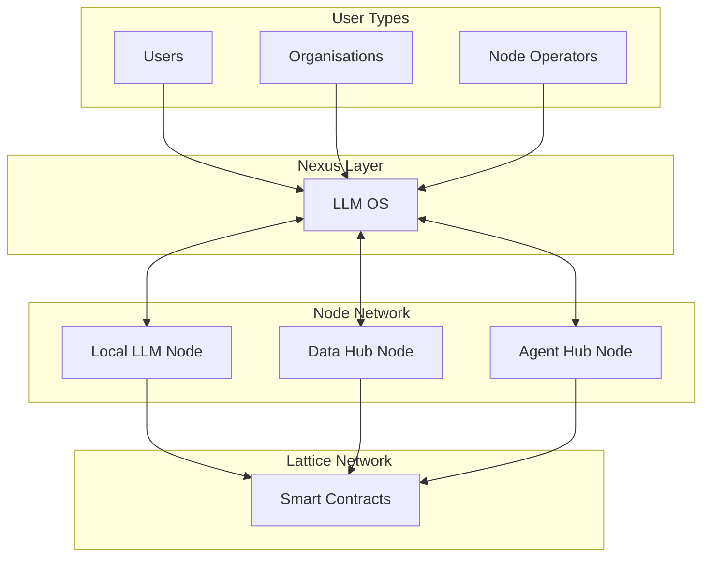
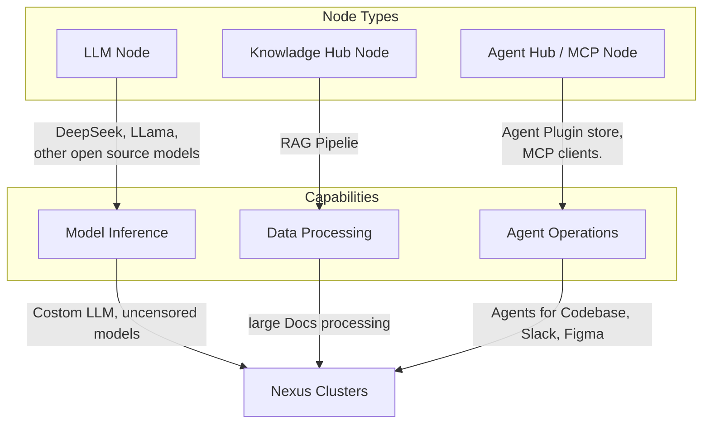

**Decentralized AI Inference Network and LLM OS**

## **Abstract**

The increasing centralization of artificial intelligence infrastructure has created significant barriers to accessing and deploying AI technologies, particularly for enterprise and privacy-sensitive applications. This paper presents [Lattice.ai](http://lattice.ai/), a decentralized protocol for AI inference that implements a three-layer architecture: a blockchain-based economic layer, a coordination layer (Nexus), and a distributed compute layer. The system enables the deployment of various open-source language models across a network of specialized nodes, including base inference nodes, retrieval-augmented generation (RAG) nodes, and agent nodes for complex task execution.

The protocol architecture addresses key limitations of centralized systems through a token-based economic model that aligns incentives between compute providers and users. The system incorporates reputation scoring, automated quality assurance, and dynamic load balancing to maintain service reliability. The implementation supports diverse workloads ranging from basic inference to sophisticated multi-step reasoning while maintaining data privacy through local processing options and on-premise deployments.

The protocol's design enables customizable deployment configurations for specific use cases, supporting private clusters and enterprise integrations. Advanced features include knowledge hub nodes for RAG pipelines, agent workflows for complex tasks, and integration capabilities with existing enterprise systems such as development environments and communication platforms. These architectural choices create a framework for decentralized AI infrastructure that prioritizes privacy, customization, and accessibility while maintaining the performance characteristics required for production deployments.

## **Introduction**

[Lattice.ai](http://lattice.ai/) is a decentralized AI inference network that connects users directly with a distributed network of open-source AI models. Our platform creates a decentralized prompt economy powered by the LAI token, enabling transparent, accessible, and personalized AI experiences for individuals and organizations alike. By leveraging a network of distributed nodes running local language models, Lattice provides AI capabilities without relying on centralized infrastructure.

The Lattice ecosystem consists of multiple interconnected layers that work in harmony to deliver seamless AI experiences. At its foundation lies the protocol layer, which handles economic incentives, node registration, and reputation scoring through smart contracts. Above this sits the Nexus layer (LLM OS), which serves as the coordination mechanism that intelligently routes queries and manages the network's operational flow. The node network layer comprises various specialized node types including LLM Nodes for model inference, Knowledge Hub Nodes for RAG pipelines, and Agent Hub Nodes for advanced agent operations.

Our Agent Hub represents a significant advancement in AI utility, enabling complex agent chains that can perform sophisticated tasks across multiple domains. These agents can interact with external systems, maintain context across sessions, and execute multi-step reasoning processes. The RAG (Retrieval Augmented Generation) capabilities provided by our Knowledge Hub Nodes allow models to access and utilize external data sources, dramatically improving response quality and factual accuracy in specialized domains.

This multi-layered approach creates a parallel processing environment where different types of AI workloads can be efficiently distributed across the network according to node specialization and capability. Our Nexus coordination layer manages user creation, economics, and network operations, creating a seamless experience while maintaining the benefits of decentralization and enabling unprecedented flexibility in how AI services are delivered.

## **The Problem**

The current AI landscape faces several critical challenges. AI inference is predominantly controlled by a few large corporations, creating single points of failure and limiting innovation. Users have little visibility into how AI models process their data or how pricing is determined. Enterprise AI solutions often lack the flexibility to adapt to specific organizational needs. To set up a compliant network of on-premise LLM on organizational data, enterprises do not have an easy-to-integrate system, and no platform provides multiple open-source model support on a decentralized ecosystem. Running powerful AI models requires significant computational resources, making them inaccessible to many users and organizations. Additionally, centralized AI systems often require sending sensitive data to third-party servers, raising privacy and security issues.

## **Our Solution**

[Lattice.ai](http://lattice.ai/) addresses these challenges through a decentralized network architecture that distributes AI processing across a network of nodes, reducing reliance on centralized providers. We ensure transparency by recording all transactions, economics, and operations on-chain for public visibility. Our platform enables customization by allowing users to create personalized clusters of nodes tailored to specific needs. By creating an efficient marketplace for AI inference with competitive pricing, we significantly reduce costs while enhancing privacy through on-premise solutions and local processing options for sensitive data.

We provide an open ecosystem where users can participate in the network by running full nodes or by joining staking pools to run open-source LLM nodes, which also help them earn rewards through node earnings. [Lattice.ai](http://lattice.ai/) offers a unified platform where users can access all solutions in one place - from agent-building infrastructure to network participation, building applications on truly decentralized AI, and running agents on a decentralized platform.

## **Protocol Architecture**

Lattice functions as a protocol rather than a full-fledged blockchain, operating on a hybrid infrastructure. Smart contracts handle user registration, node registration, tokenomics, and reputation scoring. The Nexus (LLM OS) acts as a coordination layer that routes queries, monitors node health, and facilitates settlement between users and nodes. Nodes (Decentralized Inference Providers) run AI models and respond to user queries in exchange for LAI token rewards.

## **Key Components**

### **Nexus (LLM OS)**

Nexus serves as the central coordination mechanism of the Lattice network. It routes user queries to the most optimal node based on availability, latency, cost, and reputation. The system handles tokenomics including credit deductions and rewards distribution while monitoring node health and uptime, reporting back to smart contracts. Nexus optionally stores chat history and logs based on privacy preferences and provides a unified interface for users to interact with the network. This sophisticated LLM Operating System orchestrates the complex ecosystem of [Lattice.ai](http://lattice.ai/)'s network components, managing the platform's economic engine and establishing fair and transparent market dynamics for computation resources. Nexus serves as the critical bridge between end users and computational nodes, calculating operational costs with precision while maintaining secure credential management. The system leverages blockchain-based smart contracts as its foundational source of truth, ensuring transparent and immutable record-keeping across the network.

### **Smart Contracts**

Lattice's on-chain components include several key smart contracts that form the backbone of the network's economic and governance systems. The UserRegistry registers users and manages token balances, creating a secure identity layer for the platform. The NodeRegistry registers and maintains node metadata including model type, uptime, and reputation, enabling effective query routing and incentive distribution. The NetworkStatus contract tracks node health and periodically updates statuses on-chain, ensuring the network operates with maximum reliability. The Tokenomics Module handles gas fees (AI inference fees), credit deductions, and rewards for nodes, creating a complete economic ecosystem that incentivizes participation and quality service.

### **Nodes (Inference Providers)**

Nodes are the computational backbone of the Lattice network, running local LLM models such as DeepSeek R1, LLaMA, and other open-source models. These nodes provide AI inference for both chat-based and API-based queries, earning rewards based on usage and performance through tokenized incentives. Nodes communicate with the Nexus for query processing and credit deduction and can be run on various hardware configurations from home computers to dedicated servers. The distributed nature of these nodes ensures that the network remains resilient, with no single point of failure, while the economic incentives ensure that node operators are motivated to provide reliable, high-quality service.

The Node Network is structured with different specialized node types that serve various functions within the ecosystem:

## **Protocol Workflow**

The Lattice protocol operates through a series of well-defined workflows that ensure smooth operation and user experience. User registration begins when a user lands on the client interface and registers using passkeys or Google login. The Nexus forwards these details to the UserRegistry smart contract, where the user account is created and mapped to an on-chain identity. Users can then use [Lattice.ai](http://lattice.ai/) services using LAI tokens, with initial credits provided through our faucet to facilitate immediate engagement with the platform.

Node initialization occurs when a node owner visits the protocol website and selects a node type such as DeepSeek R1 or LLaMA. After paying any required stake or deposit, the Nexus forwards node details to the NodeRegistry smart contract. The node is then registered and added to the active inference network. Users have the option to run LLMs on local machines or self-hosted cloud services for enhanced privacy. Lattice also provides one-click node deployment with both private clusters and Nexus open cluster options, making it easy for anyone to become a node operator regardless of technical expertise.

The query resolution process starts when a user enters a query through the Lattice interface. The Nexus identifies the optimal node based on parameters like latency, cost, and availability, then establishes a session between the user and the selected node. The node processes the query and returns responses, calling Nexus for credit deduction (inference fee). Nexus aggregates this data and periodically updates the UserRegistry for token settlements, ensuring transparent and efficient economic operations.

Throughout this process, Nexus continuously performs health checks on nodes, updating node status and reputation scores in the NetworkStatus smart contract. If a node fails these health checks, it is removed from active routing to maintain network quality. High-performing nodes receive reputation bonuses, increasing their likelihood of being selected for future queries and creating a meritocratic system that rewards quality and reliability.

## **Open Source LLM and Decentralized AI**

[Lattice.ai](http://lattice.ai/) is fundamentally built on the principle of democratizing access to advanced AI capabilities through open-source language models. Our network supports and promotes the use of various open-source LLMs, including DeepSeek R1, LLaMA, and others, creating a diverse ecosystem of AI models with different capabilities and specializations. By leveraging open-source models, we ensure transparency in how models process data and make decisions, enabling users to understand and trust the AI systems they interact with.

The decentralized nature of our network ensures that no single entity controls the AI infrastructure, preventing censorship and enabling uncensored, privacy-preserving AI interactions. This approach aligns with the core values of web3 and represents a significant step toward truly user-owned AI systems. Open-source models combined with decentralized infrastructure create unprecedented opportunities for innovation, allowing developers and organizations to experiment with and build upon existing models without the restrictions imposed by proprietary systems.

## **Advanced Capabilities**

[Lattice.ai](http://lattice.ai/) offers several advanced capabilities that enhance the utility and versatility of the platform. Retrieval Augmented Generation (RAG) pipelines allow LLMs to leverage external knowledge sources for enhanced accuracy and context awareness. These pipelines enable processing and indexing of large documents, real-time retrieval of relevant information, and enhanced response generation with factual grounding. Knowledge Hub Nodes in the Lattice network specifically support these RAG capabilities, creating a network of information processing units that enhance the overall intelligence of the system.

LLM agent chains support sophisticated reasoning and task execution across multiple steps, allowing the breaking down of complex tasks into manageable steps, integration with external tools and APIs, and the maintenance of context across multiple interactions. The Model Context Pipeline (MCP) enhances LLM capabilities by managing and extending context windows, enabling long-term memory across sessions, and optimizing prompt engineering for better results. These advanced capabilities make [Lattice.ai](http://lattice.ai/) suitable for a wide range of applications, from simple chat interfaces to complex enterprise solutions requiring sophisticated reasoning and domain-specific knowledge.

## **Network Stability and Reliability**

[Lattice.ai](http://lattice.ai/) prioritizes network stability and reliability through several key mechanisms designed to ensure consistent service quality. A robust reputation system continuously monitors and rates nodes based on performance, uptime, and response quality, creating incentives for reliable operation. The distributed nature of the network ensures that if some nodes go offline, others can pick up the load, preventing service interruptions. Economic incentives structured through the LAI token model encourage node operators to maintain high-quality service, aligning their interests with those of the network as a whole.

Smart contract governance enforces network parameters and rules, ensuring consistent operation across the distributed system. Nexus continuously monitors node health and removes underperforming nodes from routing, maintaining service quality even as individual nodes may experience issues. These mechanisms work together to create a resilient, self-regulating network that can provide consistent AI services even under varying conditions, making [Lattice.ai](http://lattice.ai/) suitable for both casual users and enterprise applications with strict reliability requirements.

## **Tokenomics**

The LAI token serves as the native utility token of the Lattice network, powering all transactions, incentives, and governance mechanisms. Users pay LAI tokens to use AI models on the network, while node operators earn LAI tokens for processing queries. The token architecture supports sophisticated LLM node staking and rewards systems, incentivizing network participation while ensuring computational resource availability. Users can stake LAI tokens to earn passive income from network fees, participate in protocol governance decisions, and organizations can purchase LAI tokens for private clusters and enterprise solutions.

Node operators within the [Lattice.ai](http://lattice.ai/) network earn LAI tokens through a sophisticated multi-variable reward system that quantifies their contributions based on compute power allocation, query resolution throughput, and verified network uptime statistics. This performance-based approach ensures fair compensation while maintaining high service standards across the network. The ecosystem empowers users to stake tokens for enhanced network scalability and security, with staked amounts directly supporting LLM node operations and generating competitive annual percentage yields derived from node earnings. To sustain network infrastructure and future development, a portion of transaction fees is allocated to network maintenance, ensuring long-term viability while maintaining cost efficiency for network participants.

## **Use Cases and Clusters**

[Lattice.ai](http://lattice.ai/) enables powerful use cases across different user segments through its flexible architecture and clustering capabilities. Individual users benefit from personalized AI usage with access to any open source model, privacy-focused interactions that don't share sensitive data with centralized companies, and the ability to monetize unused computing resources by running nodes. The platform offers an affordable and customizable alternative to proprietary AI services, putting control back in the hands of users.

Enterprises and organizations can create custom AI clusters for internal and confidential content, deploying private LLM environments that operate within their security boundaries. These clusters can connect with existing enterprise systems like Slack, email, and source code repositories, creating an integrated AI experience across organizational tools. [Lattice.ai](http://lattice.ai/)'s compliance solutions enable on-premise AI systems that meet specific regulatory requirements in industries with strict data handling regulations. By reducing AI infrastructure costs through the decentralized marketplace, organizations can deploy specialized agents for specific jobs without the expense of building custom AI infrastructure.

Educational institutions and research labs can deploy specialized LLM environments for research and teaching purposes, maintaining control over sensitive data while enabling advanced AI capabilities. Developers can build AI-powered applications on top of the Lattice network, create specialized plugins for specific use cases, and develop tailored AI experiences for clients using customized clusters. The platform's flexibility and decentralized nature make it ideal for building specialized AI solutions across a wide range of domains and requirements.

## **Future Vision**

[Lattice.ai](http://lattice.ai/)'s roadmap envisions evolutionary growth from its current protocol architecture to a full-chain infrastructure, enabling the development of a more robust economic ecosystem with significantly enhanced performance characteristics. This transition will enable more complex economic mechanisms, improve scalability and throughput, create new opportunities for ecosystem participants, and enhance security and decentralization. The platform's commitment to open-source AI creates a foundation for continuous innovation and improvement.

We aim to revolutionize resource utilization by enabling household devices to generate LAI tokens during idle computing periods, creating new economic opportunities for consumers. This DePIN (Decentralized Physical Infrastructure Network) approach will expand the node network to include consumer devices, create new economic opportunities for device owners, increase network capacity and distribution, and reduce environmental impact by utilizing existing hardware more efficiently. The integration of everyday computing devices into the Lattice network represents a significant step toward truly democratized AI infrastructure.

Central to our vision is the establishment of a self-sustaining agent economy where autonomous AI entities provide value, consume resources, and participate in complex economic relationships within the network. These agents will be capable of performing specific tasks, interacting with each other, and operating with increasing levels of autonomy. Research initiatives focus on creating seamless personal AI assistant experiences that intuitively understand user contexts and requirements, while the platform remains committed to fostering an expansive open-source AI ecosystem that democratizes access to advanced language models.

## **Contact & Resources**

### **Official Channels**

- **Twitter**: [@0xLattice](https://x.com/0xLattice)

---

This litepaper outlines the vision, architecture, and roadmap for [Lattice.ai](http://lattice.ai/). As the project evolves, we will release more detailed technical documentation and updates. Join our community channels to stay informed about the latest developments and opportunities to participate in the Lattice ecosystem.

© 2025 [Lattice.ai](http://lattice.ai/) - All Rights Reserved
